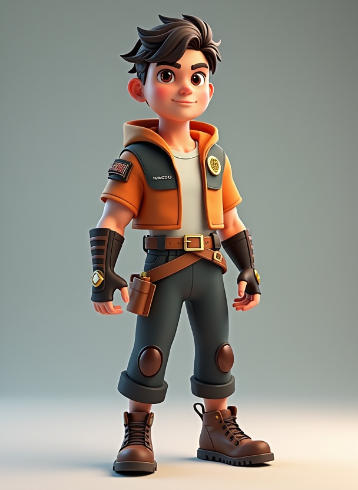
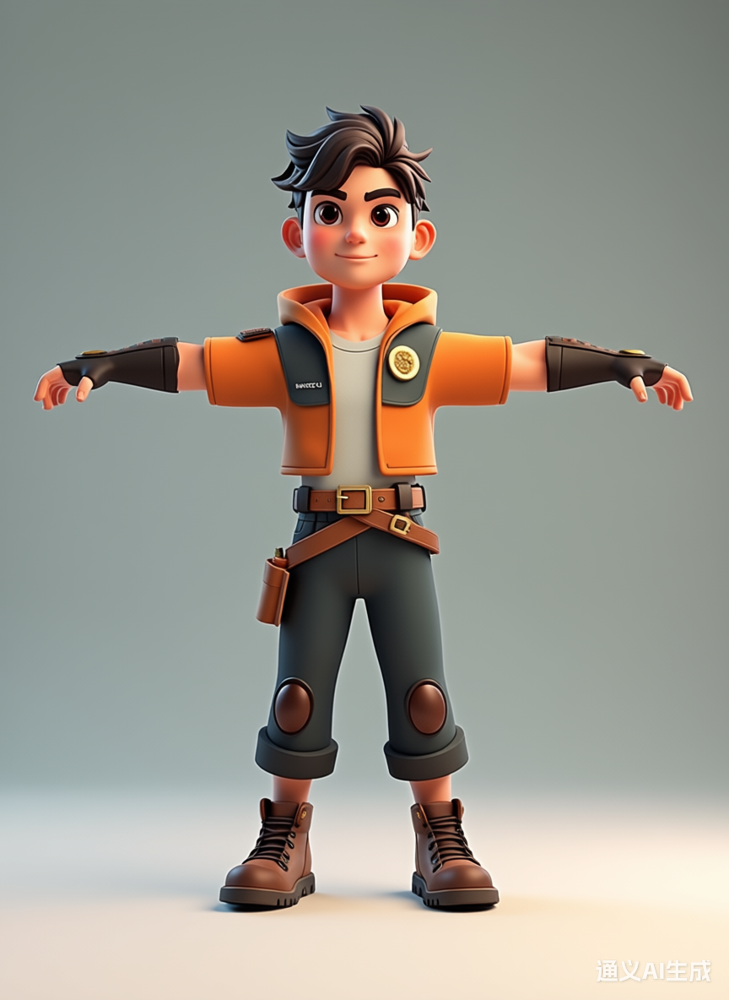
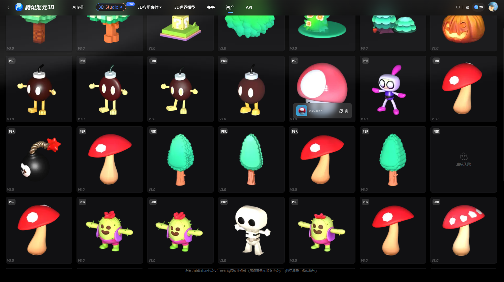

# Brick Fury: AI-Assisted Unity Game Development

# 1. Overview

This project is a Unity-based Rogue-like game in which players move to avoid enemies and survive waves of monsters. As players progress and level up, cards appear that provide buffs and enhancements to strengthen the player.  

The goal of this project is to explore how AI can enhance and accelerate the process of game development while preserving human creativity and technical control.  
## Start Menu
<p align="center">
  
</p>

## Game Play
<p align="center">
  
</p>

# 2. Team Responsibilities and Workflows

## Dong Yang

- Game planning and core gameplay design
- Main character model generation
- Card generation and integration within the game
- Player control and skill system implementation
- Game Over UI design and logic
- Background music and skill sound generation

### Code Generation

- AI Tools: [Codex](https://openai.com/codex/) and [Unity MCP](https://github.com/CoplayDev/unity-mcp)
- [Chat History](./Attachments/Chat - Dong Yang - 7564031.zip)

### Model Generation

1. **Generate prompts:** Use GPT-5 to create detailed prompts that match the visual style of the game’s existing models.

2. **Run workflow:** Use the ComfyUI workflow from Assignment 2 with the FLUX.1-dev Q8 GGUF model, and disable Lora.

3. **Refine prompts:** Adjust the prompts with GPT-5 based on the images produced in the previous step.

   ```
   3D stylized character model, T-pose, Upper arms and lower arms fully extended horizontally, hands fully open and facing down.
   
   young male proportions 6.5–7 heads, soft lines, short hair or sporty headband, bright confident expression, low‑poly, hand‑painted textures, chunky bevels, rounded edges, clear blocky forms, compact silhouette.
   
   Mage vibe outfit, cropped jacket, hooded short vest, short stand‑collar jacket, simple inner top, waist sash or wide belt, small pouches and scroll loops, light utility belt, shoulder pad and bracers, wrist guards, geometric brick emblems (brooch, belt), fingerless gloves or wraps, tapered pants or knee‑length shorts with kneepads, high‑top shoes/boots.
   
   Matte hand‑painted finish, clean color blocking, painted edge highlights, measured brushwork.
   ```

4. **Iterate:** Repeat the process until the results meet quality expectations.

   

5. **Pose adjustment:** Use [Qwen3 Max](https://www.tongyi.com/qianwen/) to transform the image into T-pose.

   

6. **Model generation:** Upload the T-pose image to [Rodin](https://hyper3d.ai/) to generate a 3D model. Download both the shaded and PBR versions as FBX files.
7. **Unity setup:** Import the PBR version to Unity.

### Animation Generation

#### Mixamo

1. **Model upload:** Upload the shaded version to [Mixamo](https://www.mixamo.com/#/) for automatic rigging. (The PBR version cannot be auto‑rigged due to unknown limitations.)
2. **T‑pose export:** Export the T-pose animation with skin as an FBX file.
3. **Material replacement:** Replace the PBR version's material to the model.
4. **Animation export:** Export *Idle* and *Fast Run* animations without skin as FBX files.
5. **Unity setup:** Import all FBX files into Unity and configure the animation type as *Humanoid*.

#### Deepmotion

1. **Prompts generation:** Use GPT-5 to generate detailed prompts describing a human falling forward.

   ```
   A humanoid character suddenly loses all strength, knees buckle, body collapses forward, arms slightly spread, torso leaning down, and the whole body falls face-first onto the ground with natural gravity and momentum.
   ```

2. **Animation generation:** Use the prompts with [Deepmotion](https://saymotion.deepmotion.com/) to produce the animation.

3. **Unity setup:** Export the animation as a FBX file. Import it into Unity and configure the animation type as *Humanoid*.

   

### Image Generation

- **AI Tool:** GPT-5 and Qwen3 Max

  

  

### Sound Effect Generation

- AI Tool: ComfyUI
- Workflow: Assignment5-Sound-StableAudioOpen

### Music Generation

- **AI Tool:** [Suno](https://suno.com/)
- **Prompt:** Light upbeat cartoon battle BGM, subtle orchestral, loop-friendly, cheerful not heavy.
- **Result:** background music for the title screen and gameplay scene

## Renkai Ma

- Designing and generating **enemy models** using AI-assisted tools (*Hunyuan 3D v3.0*)
- Designing and implementing **enemy behavior logic** with the help of AI tools such as *ChatGPT*, accelerating development and improving system efficiency
- Developing and optimizing most of the **UI**, including the **Start Menu**, **Pause Screen**, and **in-game value display**
- Using generative AI tools to create and place **in-game objects** and environmental assets
- Arranging **terrain layouts** and object placement to improve level design, visual balance, and gameplay flow
- Generating enemy attack sound effects using *Stable Audio Open 1.0*

| Tool                      | Role                    | Example Usage                                                |
| ------------------------- | ----------------------- | ------------------------------------------------------------ |
| **Hunyuan 3D v3.0**       | 3D model generation     | Generated enemy models and environmental objects             |
| **Stable Audio Open 1.0** | Sound effect generation | Created sound effects for enemy attacks and skills           |
| **Unity**                 | Game engine             | Integrated assets, implemented enemy behavior logic, terrain and object placement |
| **Mixamo**                | Rigging and animations  | Applied animations to enemy models                           |
| **Blender**               | 3D editing              | Converted models to FBX, adjusted model size and scale       |

[Chat History](https://drive.google.com/drive/folders/1oYRJblKnpOhADEi-_NIkUbT16GklrBKc?dmr=1&ec=wgc-drive-hero-goto)
[AIContentGeneration](https://drive.google.com/drive/folders/1i7UxOKBIvhrieIrT3MIfc-6Z11LPG-mH?dmr=1&ec=wgc-drive-hero-goto)

### Generation Workflow

The workflow for generating 3D models combines reference collection, AI-assisted image generation, and 3D model processing using multiple tools. The process is as follows:

1. **Reference Collection**  
   Begin by searching for concept or prototype images (e.g., enemy designs) on **Pinterest** to establish a visual reference and design direction.

2. **AI Image Generation**  
   Use **[Doubao AI](https://www.doubao.com/chat/)** to generate character images based on the collected references. The characters are generated in a **T-pose** to facilitate rigging and animation.

3. **Background Removal**  
   Upload the generated images to **[iloveimg.com](https://www.iloveimg.com/)** to remove the background, keeping only the clean character silhouette for 3D model generation.

4. **3D Model Generation**  
   Use **Hunyuan 3D** to generate 3D character models from the processed images. The generated models are initially exported in **GLB format**.

5. **Model Optimization and Conversion**  
   Import the GLB models into **Blender**, adjust textures, resize the model if necessary, and then export the final version in **FBX format** for better compatibility with Unity.
   
7. **Rigging with Mixamo**
   Uploaded the character model to Mixamo for automatic skeleton binding (rigging) and animation preparation.

8. **Unity Integration**  
   Import the FBX models into **Unity**, where they are integrated into the project for gameplay use, animation setup, and further customization.

<p align="center">
  
</p>

## Duoer Dai

- Card image generation using AI tools (*Q4 GGUF*)
- Initial design of the Start UI (main menu layout and structure)
- Generation of UI images and visual elements using AI-assisted design tools

# 3.Timeline (6 Weeks)

| Week | Goal | Deliverable |
|------|------|------------|
| 1 | Learn Unreal Engine 5, familiarize with the interface and basic prototyping | Basic understanding of UE5 workflow|
| 2 | Project framework & basic scene using Unreal Engine | Movable player prototype, basic hero skill implementation |
| 3 | Transition project to Unity, import assets and set up project | Unity project initialized with UE prototype assets |
| 4 | Core skill (Wave Attack) refinement & basic enemy AI | Playable demo with Wave Attack skill and functional enemy AI |
| 5 | Implement additional skills (Normal Attack, Falling Brick) | At least 2 additional skill branches playable |
| 6 | Skill upgrade system, UI completion, AI-generated content integration (art, sound, models) | Fully playable skill upgrade system, integrated visual/audio assets |

Assets created during development
🔗[https://drive.google.com/drive/folders/1k0wq6oe_rZ1G_FWIXGu-7K5lyvKph4dH?usp=sharing]

# 4. Reflections

## Dong Yang

In my view, Codex is one of the most powerful AI coding tool available today. Unity MCP, on the other hand, provides more functionality such as code validation and resource management. Together they can generate highly usable gameplay code. 

One important distinction is that Codex does not rely on codebase indexing, unlike other AI coding tools such as Cursor. Instead, it decides which files are relevant and reads them based on the given prompts. This approach can be problematic if Codex overlooks certain files. This often happens when I try to use Codex to debug. So, I usually add a line to my prompt for complex tasks: "You should read all the relevant files before implementation."

That said, "vibe coding" is not feasible even if Codex is powerful, because the tool is not fully reliable. It once took me a week to fix a bug because I didn't familiar with the codebase Codex generated. The issue appeared in a file I hadn't anticipated. Then I began to read every line Codex generated. I call this "supervised vibe coding".

Nowadays, AI workflows have matured significantly. It's now entirely possible for a single programmer to build a complete game using the available AI tools. The one major gap is in the particle systems, which still require human artists to produce, for now.

## Renkai

Generative AI tools greatly streamlined our workflow, but creating high-quality AI-generated assets still required significant time for iterative refinement.

Some limitations of the AI tools became apparent during development:

- **3D Model Generation**: For simple objects, like a cube, minimal vertex count is sufficient, yet AI-generated models often lack flexibility in adjusting vertices. Non-humanoid characters could not be automatically rigged, and sometimes the generated rigs had errors or required manual correction.

- **UI Generation**: There is currently no AI model specialized for game UI design. Most tools generate generic images, which are not always suitable for interactive game interfaces.

Overall, while AI served as a powerful assistant for speeding up content creation, **human intervention remained essential** for ensuring technical accuracy, usability, and aesthetic consistency.
